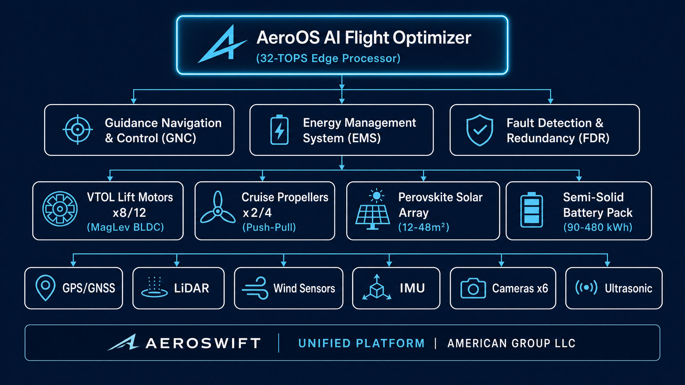

# AeroSwift-Personal (AS-1/2)
### Ultra-Efficient 1–2 Passenger Hybrid VTOL Personal Air Vehicle

**Organization:** American Group LLC  
**Product Line:** AeroSwift Platform  
**Version:** 0.1.0-alpha  
**Status:** Pre-Prototype Design Phase  
**License:** Proprietary — American Group LLC

---


---

## Overview

**AeroSwift-Personal (AS-1/2)** is a 1-to-2 passenger personal air vehicle (PAV) designed for middle-class household ownership. It combines the vertical takeoff and landing (VTOL) capability of a multirotor with the aerodynamic efficiency of a fixed-wing glider, achieving up to **10× the energy efficiency** of a conventional quadcopter at equivalent payload.

The vehicle is powered by a hybrid energy system: a **90 kWh semi-solid-state lithium-metal battery** pack supplemented by **12 m² of flexible perovskite-on-silicon solar film** laminated directly onto the wing skin. An onboard **AeroOS AI Flight Optimizer** running on a 32-TOPS edge NPU continuously manages thrust allocation, dynamic gliding, and thermal updraft harvesting.



---

## Key Specifications

| Parameter | Value |
| :--- | :--- |
| **Capacity** | 1–2 Passengers (max payload 240 kg) |
| **Wingspan** | 8.2 m (folds to 2.4 m for garage storage) |
| **Overall Length** | 5.4 m |
| **Max Takeoff Weight (MTOW)** | 850 kg |
| **Battery Chemistry** | Semi-Solid-State Li-Metal (380 Wh/kg) |
| **Battery Capacity** | 90 kWh |
| **VTOL Lift Motors** | 8× 35 kW MagLev Brushless DC Motors |
| **Cruise Propulsion** | 2× 40 kW Push-Pull Rear Propellers |
| **Solar Wing Area** | 12 m² (~3.4 kW peak generation) |
| **Max Cruise Speed** | 180 km/h (112 mph) |
| **Range (Battery Only)** | 220 km (136 miles) |
| **Range (Solar-Assisted)** | Up to 310 km (192 miles) |
| **Structural Materials** | Recycled Carbon-Fiber + Bio-Epoxy Composites |
| **Target Retail Price** | $120,000 USD |
| **FAA Certification Path** | Part 21.17(b) Special Class (Powered-Lift) |

---

## Repository Structure

```
AeroSwift-Personal/
├── hardware/
│   ├── pcb/                  # KiCad ECAD schematics & PCB layouts
│   │   ├── flight_computer/  # AeroOS main flight computer board
│   │   ├── ems_board/        # Energy Management System PCB
│   │   ├── motor_driver/     # 8-channel MagLev BLDC motor driver
│   │   └── sensor_hub/       # Sensor fusion hub (IMU, LiDAR, GPS)
│   ├── cad/                  # Mechanical CAD (STEP, IGES, STL)
│   │   ├── fuselage/         # Main body and cockpit shell
│   │   ├── wings/            # Foldable wing assembly
│   │   ├── boom_assembly/    # VTOL motor boom structures
│   │   └── landing_gear/     # Retractable tricycle landing gear
│   ├── bom/                  # Bill of Materials
│   │   ├── bom_master.csv    # Master BOM (all assemblies)
│   │   ├── bom_pcb.csv       # PCB-level BOM
│   │   └── bom_mechanical.csv# Mechanical BOM
│   └── antenna/              # RF antenna designs (GPS, LTE, V2X)
├── firmware/
│   ├── aeros_core/           # AeroOS real-time kernel (C++20)
│   ├── gnc/                  # Guidance, Navigation & Control algorithms
│   ├── ems/                  # Energy Management System firmware
│   └── fdr/                  # Fault Detection & Redundancy module
├── software/
│   ├── aeros_ai/             # Python: AI flight optimizer & thermal map
│   ├── ground_station/       # React: Ground control station web app
│   └── mobile_app/           # React Native: Owner companion app
├── docs/
│   ├── specs/                # Technical specifications & datasheets
│   ├── regulatory/           # FAA certification documents & checklists
│   └── academic/             # White papers & journal submissions
├── assets/                   # Concept renders & marketing visuals
└── README.md
```

---

## Technology Stack

### Hardware
* **Flight Computer SoC:** Rockchip RK3588S (6× ARM Cortex-A76/A55, 32-TOPS NPU)
* **Co-Processor:** STM32H7B3 (ARM Cortex-M7 @ 280 MHz) for hard real-time motor control
* **VTOL Motors:** 8× Custom 35 kW Outrunner BLDC with Permanent-Magnet MagLev Bearings
* **Cruise Motors:** 2× 40 kW Carbon-Fiber Composite Push-Pull Propellers
* **Battery:** 90 kWh Semi-Solid-State Li-Metal (Modular 4× 22.5 kWh packs)
* **Solar:** 12 m² Perovskite-on-Silicon Tandem Film (28.5% efficiency, 0.25 kg/m²)
* **IMU:** Epson G362P (6-DOF, ±300°/s, ±8g)
* **LiDAR:** 360° Solid-State LiDAR (200m range, 0.1° angular resolution)
* **GPS/GNSS:** Dual-frequency RTK GPS (±2 cm accuracy)
* **V2X Comms:** Autotalks TEKTON3 (DSRC + C-V2X Sidelink)

### Software
* **AeroOS Core:** C++20 real-time flight control kernel with ROS 2 Humble middleware
* **AI Optimizer:** PyTorch Lite model for wind map prediction and energy scheduling
* **Ground Station:** React + TypeScript web dashboard with live telemetry
* **Mobile App:** React Native companion app (iOS + Android)

---

## Flight Phases

```
Phase 1: VTOL Takeoff         Phase 2: Transition           Phase 3: Cruise
─────────────────────         ──────────────────────        ─────────────────
8× VTOL motors active         Cruise propellers engage      VTOL louvers closed
Hover at 50m AGL              Accelerate to 80 km/h         Wing lift dominant
Obstacle scan (LiDAR)         Wings generate lift           AI thermal search
                              VTOL motors throttle down     Solar charging active
                                                            Regen on descent
```

---

## Energy System

The AeroSwift-Personal employs a four-source energy architecture managed by the **Energy Management System (EMS)**:

1. **Primary Battery (90 kWh):** Provides the bulk of energy for VTOL phases and cruise.
2. **Perovskite Solar Array (3.4 kW peak):** Supplements cruise energy and recharges during idle.
3. **Regenerative Descent:** Rear propellers act as turbines during descent, recovering up to 8% of landing energy.
4. **Dynamic Gliding:** AI-detected thermal columns allow motor-off gliding for up to 40 km per thermal event.

---

## Regulatory Compliance

| Regulation | Status | Notes |
| :--- | :--- | :--- |
| FAA Part 21.17(b) Special Class | In Design | Powered-lift certification pathway |
| FAA Part 107 (Remote Ops) | Planned | For unmanned delivery mode |
| DO-178C (Software) | Planned | Level A for flight-critical software |
| DO-254 (Hardware) | Planned | Level A for flight-critical hardware |
| ASTM F3345 (eVTOL Airworthiness) | Planned | Consensus standard for UAM |

---

## Roadmap

| Milestone | Target Date | Description |
| :--- | :--- | :--- |
| Architecture Design | Q2 2026 | This document |
| PCB Prototype v0.1 | Q4 2026 | Flight computer & EMS boards |
| Mechanical Prototype | Q2 2027 | Carbon-fiber airframe build |
| Hover Test | Q4 2027 | Tethered VTOL hover validation |
| Full Flight Test | Q2 2028 | First untethered flight |
| FAA Certification | 2029 | Part 21.17(b) submission |
| Commercial Launch | 2030 | Consumer sales begin |

---

## Contributing

This is a proprietary American Group LLC product. Internal contributors should follow the [CONTRIBUTING.md](CONTRIBUTING.md) guidelines. External academic collaborations are welcome — see [docs/academic/](docs/academic/) for white paper drafts.

---

## License

Copyright © 2026 American Group LLC. All Rights Reserved.  
Patents Pending.
